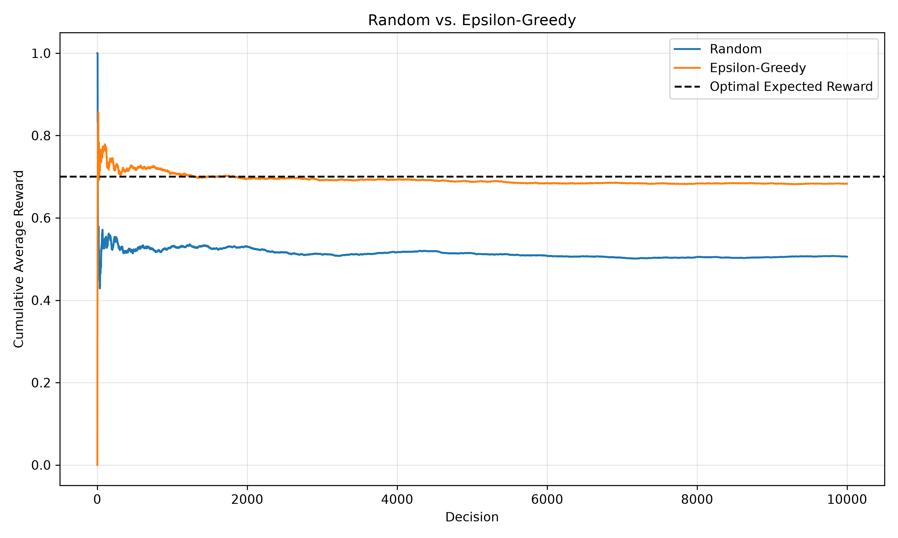

# Multi-Armed-Bandit

Simulation and evaluation of multi-armed bandit algorithms in Python.

The project compares two methods:

* Random selection
* Epsilon-greedy

## Setup

There are three arms with true reward probabilities:

```python
true_probs = [0.3, 0.5, 0.7]
```

The simulation runs for 10,000 decisions with:

```python
epsilon = 0.1
seed = 17
```

Each arm returns either 0 or 1. An arm with a higher probability is more likely to return 1.

## Results

| Method         | Average Reward | Optimal Arm Selection Rate |
| -------------- | -------------: | -------------------------: |
| Random         |         0.5057 |                     0.3339 |
| Epsilon-Greedy |         0.6830 |                     0.9300 |

The random method selects all three arms about equally.

The epsilon-greedy method learns that the third arm has the highest reward probability and selects it most of the time.


