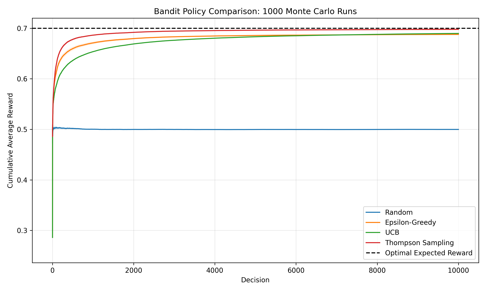
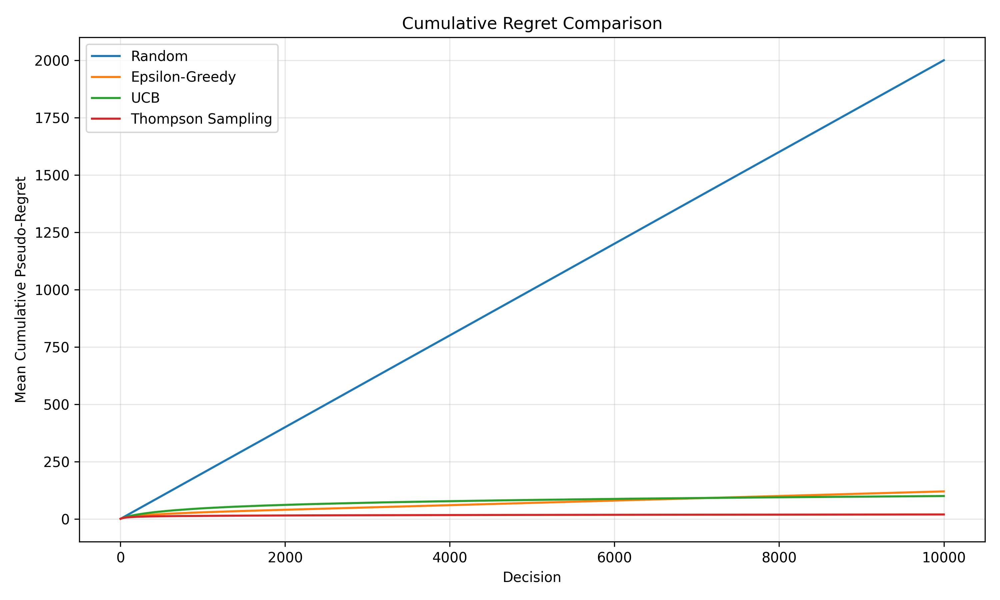

# Multi-Armed Bandit Simulation

This project implements several algorithms for the stochastic multi-armed bandit problem and compares their performance in Bernoulli reward environments.

The main goal is to compare different exploration and exploitation strategies using average rewards and cumulative regret. I also tested how the algorithms perform when the reward probabilities of the arms become closer.

## 1. Algorithms

Four policies are included:

- **Random:** Selects an arm uniformly at random. Used as a baseline.
- **Epsilon-Greedy (EG):** Usually selects the arm with the highest estimated reward probability, but explores randomly with probability epsilon.
- **Upper Confidence Bound (UCB):** Selects an arm based on its estimated reward and an exploration bonus.
- **Thompson Sampling (TS):** Samples from the Beta posterior distribution of each arm and selects the arm with the highest sampled probability.

For Epsilon-Greedy, I used a fixed epsilon of 0.05.

For UCB, the exploration bonus is:

`sqrt(2 * log(t) / N_i)`

For Thompson Sampling, each arm starts with a Beta(1,1) prior. After observing a reward, the posterior parameters are updated based on the number of successes and failures.

## 2. Simulation Setup

The main experiment uses three Bernoulli arms with true reward probabilities:

`true_probs = [0.3, 0.5, 0.7]`

Each policy is evaluated using:

- 10,000 decisions per simulation
- 1,000 Monte Carlo runs
- Fixed random seeds for reproducibility
- Separate random number generators for policy decisions and reward generation

The main performance measures are:

- Cumulative average reward
- Cumulative pseudo-regret
- Mean regret across Monte Carlo runs
- 95% confidence intervals for differences in average reward

Cumulative pseudo-regret is calculated as the sum of the differences between the best expected reward and the expected reward of each selected arm.

## 3. Main Results

The following results are from 1,000 Monte Carlo simulations with 10,000 decisions per run.

| Algorithm | Mean Average Reward | Mean Cumulative Pseudo-Regret |
|---|---:|---:|
| Random | 0.499799 | 2000.507 |
| Epsilon-Greedy | 0.687808 | 119.713 |
| UCB | 0.689798 | 99.537 |
| Thompson Sampling | 0.697823 | 19.046 |

In this experiment, Thompson Sampling achieves the highest average reward and the lowest cumulative pseudo-regret.

I also calculated the differences in final average rewards between policies.

| Comparison | Mean Difference | 95% CI |
|---|---:|---|
| EG vs Random | 0.188009 | [0.187637, 0.188381] |
| UCB vs EG | 0.001991 | [0.001688, 0.002293] |
| TS vs UCB | 0.008025 | [0.007911, 0.008139] |

These comparisons are based on the same bandit environment and fixed algorithm parameters.

### Average Reward Comparison

### Cumulative Regret Comparison

## 4. Comparison Under Different Environments

I also tested the four algorithms under different Bernoulli reward probabilities to see how their performance changes when the arms become more similar.

I used four environments with different reward probabilities and compared the mean reward, cumulative pseudo-regret, and optimal arm selection rate.

Each experiment uses 100 Monte Carlo runs with 3,000 decisions per run.

| Environment | True Probabilities | Gap Between Best Two Arms |
|---|---|---:|
| Easy | [0.3, 0.5, 0.7] | 0.20 |
| Medium | [0.4, 0.6, 0.7] | 0.10 |
| Hard | [0.60, 0.65, 0.70] | 0.05 |
| Very Hard | [0.68, 0.69, 0.70] | 0.01 |

For these initial tests, I used 100 Monte Carlo runs with 3,000 decisions per run.

### Mean Cumulative Pseudo-Regret

| Environment | Random | EG | UCB | TS |
|---|---:|---:|---:|---:|
| Easy | 599.528 | 46.330 | 68.920 | 18.732 |
| Medium | 399.659 | 50.599 | 79.932 | 21.336 |
| Hard | 149.882 | 47.592 | 81.512 | 30.270 |
| Very Hard | 29.976 | 23.443 | 26.478 | 23.007 |

### Optimal Arm Selection Rate

| Environment | Random | EG | UCB | TS |
|---|---:|---:|---:|---:|
| Easy | 33.38% | 94.36% | 90.85% | 97.41% |
| Medium | 33.38% | 87.21% | 80.61% | 94.68% |
| Hard | 33.38% | 73.70% | 60.13% | 84.11% |
| Very Hard | 33.38% | 44.87% | 39.78% | 45.78% |

### Observations

Thompson Sampling has the lowest mean regret in all four environments tested.

In the 3,000-decision experiments, Epsilon-Greedy performs better than the current UCB implementation. However, in the main 10,000-decision experiment, UCB has lower mean regret than Epsilon-Greedy.

This suggests that the comparison may depend on the time horizon and exploration parameters.

As the reward probabilities become closer, all three learning algorithms select the optimal arm less frequently. In the Very Hard environment, the differences in regret are relatively small because selecting a suboptimal arm causes only a small expected reward loss.

The sensitivity results are preliminary, and more simulations would be useful for comparing small performance differences.

